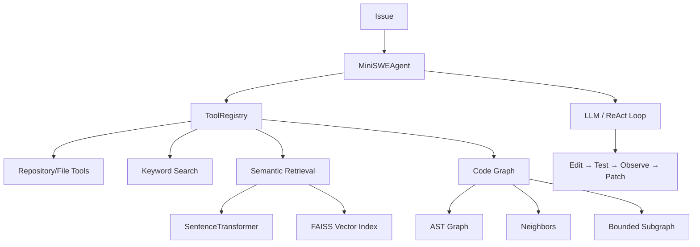

# Gemma 4 Developer Agent

An incremental research and prototyping implementation toward the Google Gemma 4 Developer Agent Competition.

## Overview

The goal of this project is to build an autonomous Software Engineering (SWE) agent that can understand an issue, navigate a repository, locate relevant code, retrieve useful context, reason about code relationships, modify code, run tests, and eventually diagnose failures to produce a patch.

This repository currently represents an incremental research/prototyping implementation. It is **not** yet complete, but it successfully demonstrates foundational agentic behavior, semantic code retrieval, and structured graph-based reasoning.

## Competition Context

This project is being developed in the context of **Google - The Gemma 4 Developer Agent Competition**. The ultimate objective is to produce an autonomous SWE agent capable of repository understanding, code modification, testing/debugging, and patch generation using the Gemma 4 model.

*Note: The current repository is a work-in-progress and does not yet represent a final competition submission. Some features and Kaggle harness integrations are planned for future stages.*

## Current Status

| Stage | Focus | Status |
| :--- | :--- | :--- |
| **Stage 0** | Foundation | ✅ Complete |
| **Stage 1** | Mini SWE Agent | ✅ Complete |
| **Stage 2** | Repository Intelligence & Semantic Retrieval | ✅ Complete |
| **Stage 3** | Code Graph & Structural Reasoning | ✅ Complete |
| **Stage 4** | Self-Debugging | 🚧 Not Started |

**Test Status:** 158 / 158 tests passing.

## Architecture

The following diagram represents the **current** implemented architecture. Future components (like Stage 4 self-debugging) are not depicted.



## Stage 0 — Foundation

Stage 0 established the project basics:
- Project initialization and repository structure.
- Initial architecture design and roadmap planning.
- Creation of a sandbox environment (`sandbox/mini_shop`) for safe testing.
- Baseline design for the agentic loop.

## Stage 1 — Mini SWE Agent

Stage 1 established the basic SWE-agent and tool foundation. The implementation includes:
- A `Plan → Act → Observe → Reflect` (ReAct-style) workflow.
- `MiniSWEAgent`: The core autonomous loop.
- `ToolRegistry`: Safe, sandboxed workspace operations.
  - `list_files`
  - `read_file`
  - `search_code`
  - `edit_file`
  - `run_command`
  - `get_patch`
- LLM clients (Deterministic baseline, Ollama, Gemini).
- Sandbox (`mini_shop`) bug-fixing workflow and patch generation.

## Stage 2 — Repository Intelligence & Semantic Retrieval

Stage 2 implemented a complete pipeline for repository discovery and semantic code retrieval:

`Repository → Discovery → Keyword Search → Code Chunking → Embeddings → FAISS Vector Index → Semantic Retrieval → ContextBuilder → MiniSWEAgent`

**Features:**
- **Repository Discovery:** Supports common source/config/document file types while ignoring caches (e.g., `.git`, `__pycache__`).
- **Keyword Search:** A lexical baseline with basic ranking behavior.
- **Code Chunking:** Python AST-based chunking that identifies functions, classes, and methods, falling back to line-window chunking where necessary.
- **Embeddings:** Uses `SentenceTransformer` with the `all-MiniLM-L6-v2` model (384-dimensional normalized vectors).
- **Vector Index:** `FAISS` `IndexFlatIP` using normalized vectors for cosine-similarity retrieval.
- **Retriever:** Automatic indexing and semantic top-k retrieval.
- **ContextBuilder:** Enforces bounded context with chunk and character limits to protect LLM context windows.
- **Agent Integration:** Exposes `search_similar_code` to the agent with optional retrieval integration and backward compatibility.

*Evaluation Note:* Evaluation on the project's sandbox showed semantic retrieval successfully ranking the relevant target first for the evaluated issues, while the keyword baseline also retrieved the relevant code within the top results. This demonstrates functional implementations of both approaches on a small scale.

## Stage 3 — Code Graph & Structural Reasoning

Stage 3 implemented structural reasoning capabilities across four tasks:

### Task 3.1 — AST Code Graph Builder
- **Implementation:** Python AST parsing into a NetworkX graph.
- **Nodes:** Module, class, function, method, and external/imported nodes. Metadata includes symbol names, qualified names, file paths, and line numbers.
- **Edges:** `contains`, `imports`, and `calls` relationships.

### Task 3.2 — Code Neighbor Queries
- **Implementation:** `get_code_neighbors()` API.
- **Features:** Queries `incoming`, `outgoing`, or `both` directions with deterministic output and relationship metadata.

### Task 3.3 — Code Subgraph
- **Implementation:** `get_code_subgraph()` API.
- **Features:** Bounded BFS traversal (`max_depth`), supporting `incoming`/`outgoing`/`both` directions. Handles cycles, retains minimum node depth, and ensures deterministic structural results.

### Task 3.4 — Agent Integration
- **Implementation:** Integrated into the `ToolRegistry` and `MiniSWEAgent`.
- **Features:** Controlled via an `enable_graph` flag for optional lazy construction. Exposes `get_code_neighbors` and `get_code_subgraph` tools to the agent, maintaining backward compatibility and graceful degradation when disabled.

## Testing

The project maintains a rigorous testing standard. The current verified result is:

**158 / 158 tests passing**

The unit and integration tests thoroughly cover all implemented Stage 1 (Agent/Tools), Stage 2 (Retrieval/Embeddings), and Stage 3 (Graph/NetworkX) components.

## Repository Structure

```
gemma-4-developer-agent/
├── mini_swe_agent/
│   ├── agent.py
│   ├── llm.py
│   ├── prompt.py
│   ├── tools.py
│   ├── graph/
│   │   ├── ast_graph.py
│   │   ├── graph_query.py
│   │   └── __init__.py
│   └── retrieval/
│       ├── chunker.py
│       ├── context_builder.py
│       ├── discovery.py
│       ├── embedder.py
│       ├── keyword_search.py
│       ├── retriever.py
│       ├── vector_index.py
│       └── __init__.py
├── sandbox/
│   └── mini_shop/
├── tests/
│   ├── test_agent.py
│   ├── test_graph.py
│   ├── test_graph_integration.py
│   ├── test_graph_query.py
│   ├── test_graph_subgraph.py
│   ├── test_retrieval.py
│   └── test_tools.py
├── ARCHITECTURE.md
├── README.md
├── ROADMAP.md
├── requirements.txt
├── run_demo.py
├── run_demo_stage2.py
└── run_evaluation_stage2.py
```

## Technology Stack

- Python
- NumPy
- NetworkX
- SentenceTransformers
- FAISS
- Google GenAI
- Ollama
- unittest
- Git

## Current Limitations

- Graph call resolution is currently name-based.
- Full qualified cross-file symbol resolution is not yet implemented.
- Dynamic dispatch is not fully resolved.
- Graph parsing is currently limited to Python AST.
- Current retrieval evaluation is limited in scale to the sandbox.
- Graph context is currently exposed via explicit tool calls rather than a fully optimized, automatic graph-aware context pipeline.
- Final Kaggle harness integration is not yet complete.
- Final competition evaluation is not yet complete.

## Future Direction

Future stages (Stage 4 and beyond) will focus on implementing a self-debugging SWE agent capable of parsing stack traces, localizing failures, and reasoning about failed patches. Following this, the project will integrate with the Kaggle competition harness and focus on agent-specific optimizations for the Gemma 4 model.
